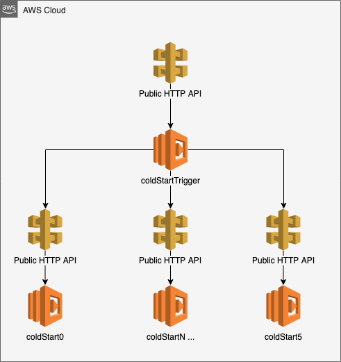
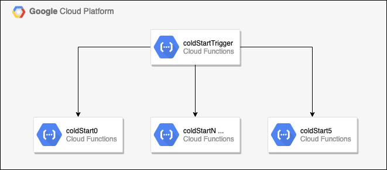
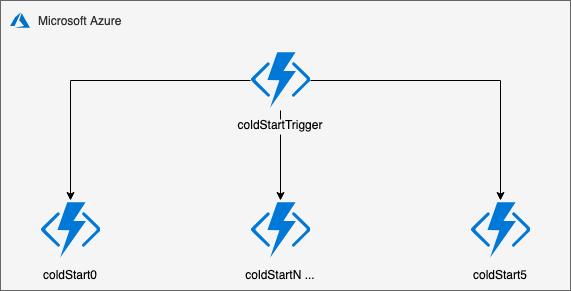
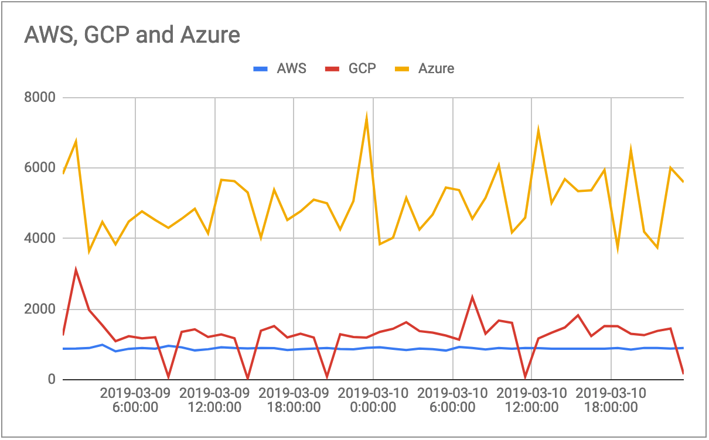
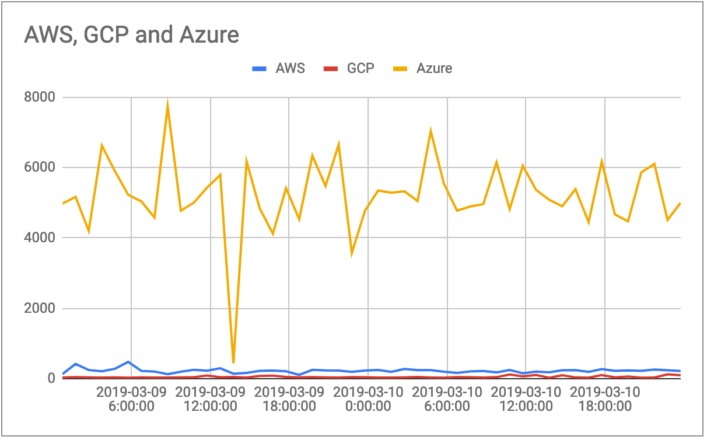
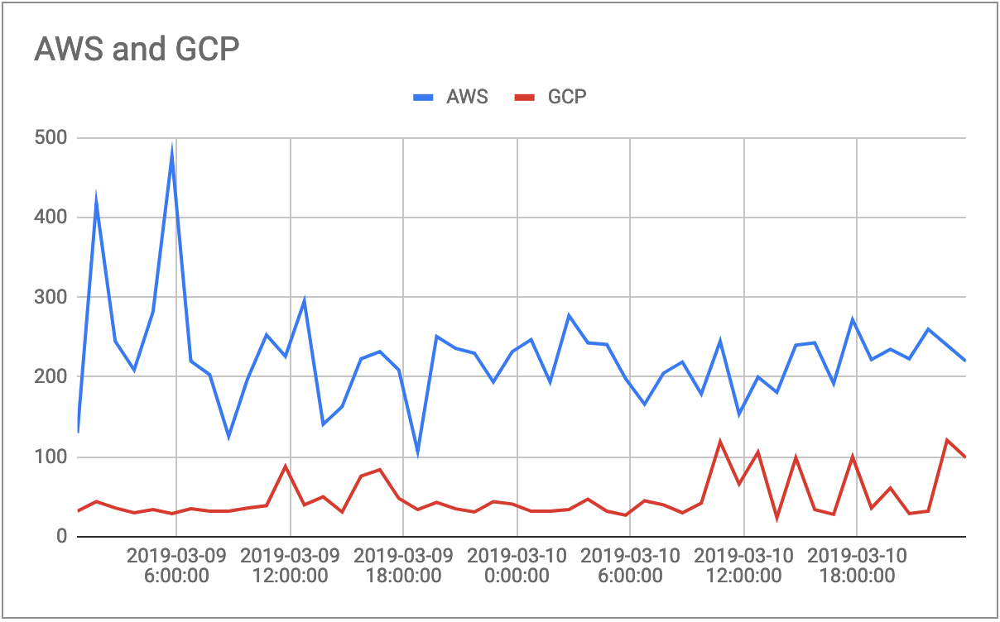

# Serverless Benchmark

- [Cold Start](#cold-start)
  - [Information](#information)
  - [Architecture](#architecture)
    - [Amazon Web Services](#amazon-web-services)
    - [Google Cloud Platform](#google-cloud-platform)
    - [Microsoft Azure](#microsoft-azure)
  - [Trigger Function](#trigger-function)
  - [Cold Start Function](#cold-start-function)
  - [Results](#results)
- [Prime Number Generator](#prime-number-generator)
  - [Information](#information-1)
  - [Architecture](#architecture-1)
    - [Amazon Web Services](#amazon-web-services-1)
    - [Google Cloud Platform](#google-cloud-platform-1)
    - [Microsoft Azure](#microsoft-azure-1)
  - [Trigger Function](#trigger-function-1)
  - [Prime Number Generator Function](#prime-number-generator-function)
  - [Results](#results-1)

---

# Cold Start

## Information

Basic benchmark script calls serverless functions on _Amazon Web Services_, _Google Cloud Platform_ & _Microsoft Azure_.

The results of the tests will show us on average how long a function takes to cold start and warm start depending on the provider.

The functions are simple and don't have any external dependencies so time to completion should be quick.

There are six functions setup on each provider, each called every 6 hours.

- `coldStart0` - `00:00`, `06:00`, `12:00`, `18:00`
- `coldStart1` - `01:00`, `07:00`, `13:00`, `19:00`
- `coldStart2` - `02:00`, `08:00`, `14:00`, `20:00`
- `coldStart3` - `03:00`, `09:00`, `15:00`, `21:00`
- `coldStart4` - `04:00`, `10:00`, `16:00`, `22:00`
- `coldStart5` - `05:00`, `11:00`, `17:00`, `23:00`

Rotating between `coldStartN` gives the function time to cool down, allowing a cold start for the next request 6 hours later.

The functions are also called on a warm start 15 minutes after the cold start request.

- `coldStart0` - `00:15`, `06:15`, `12:15`, `18:15`
- `coldStart1` - `01:15`, `07:15`, `13:15`, `19:15`
- `coldStart2` - `02:15`, `08:15`, `14:15`, `20:15`
- `coldStart3` - `03:15`, `09:15`, `15:15`, `21:15`
- `coldStart4` - `04:15`, `10:15`, `16:15`, `22:15`
- `coldStart5` - `05:15`, `11:15`, `17:15`, `23:15`

The latency of each call is tracked and recorded. It's been architected to limit round-trip time and focus on boot latency.

Each provider has it's own trigger function which calls and monitors the `coldStartN` response.

## Architecture

### Amazon Web Services


### Google Cloud Platform


### Microsoft Azure


## Trigger Function

Trigger function is called from an external scheduler. The trigger function calls the coldStart function, this ensures the bandwidth latency isn't adding extra time to the boot results.

_Azure Example_
```javascript
module.exports = async (context, _req) => {
  const https = require('https');

  const ref = await new Promise((resolve, _reject) => {
    const date = new Date();
    const hour = date.getHours();

    const options = {
      host: 'functionAddress.azurewebsites.net',
      path: `/api/functionName${hour%6}`,
      port: 443,
    };

    const response = {
      service: 'azure',
      status: 0,
      latency: null,
      date: null,
      uri: `https://${options.host}${options.path}`,
    };

    const start = Date.now();

    https.get(options, resp => {
      response.status = resp.statusCode;

      let data = '';

      resp.on('data', chunk => {
        data += chunk;
      });

      resp.on('end', () => {
        const end = Date.now();

        response.latency = end - start;

        if (data) {
          const jsonResponse = JSON.parse(data);

          response.date = jsonResponse.date;
        }

        resolve(response);
      });
    })
    .on('error', _err => {
      const end = Date.now();

      response.latency = end - start;

      resolve(response);
    });
  });

  context.res = { body: ref };
  context.done();
};
```

## Cold Start Function

The function itself is fairly simple, there are no external dependencies and the function simply returns the current timestamp.

_Azure Example_
```javascript
module.exports = (context, _req) => {
    const date = Date.now();

    context.res = {
        body: {
            date,
        }
    };

    context.done();
};
```

## Results

## Cold Start



The cold start process ran for a couple of days over a weekend. AWS and GCP have pretty consistent low results, whereas Azure was wildy inconsitent with it's boot times.


> **AWS Average** 884ms
> **GCP Average** 284ms
> **Azure Average** 4996ms

| Timestamp | AWS | GCP | Azure |
| - | - | - | - |
| 2019-03-09 0:00 | 877 |	1253 | 	5830 |
| 2019-03-09 1:00 | 881 |	3107 | 	6745 |
| 2019-03-09 2:00 | 897 |	1973 | 	3647 |
| 2019-03-09 3:00 | 988 |	1543 | 	4470 |
| 2019-03-09 4:00 | 803 |	1092 | 	3836 |
| 2019-03-09 5:00 | 875 |	1233 | 	4484 |
| 2019-03-09 6:00 | 899 |	1171 | 	4771 |
| 2019-03-09 7:00 | 879 |	1204 | 	4526 |
| 2019-03-09 8:00 | 960 |	83 | 	4303 |
| 2019-03-09 9:00 | 917 |	1354 | 	4560 |
| 2019-03-09 10:00 | 830 |	1429 | 	4844 |
| 2019-03-09 11:00 | 863 |	1210 | 	4149 |
| 2019-03-09 12:00 | 917 |	1282 | 	5663 |
| 2019-03-09 13:00 | 897 |	1174 | 	5628 |
| 2019-03-09 14:00 | 886 |	35 | 	5308 |
| 2019-03-09 15:00 | 898 |	1388 | 	4030 |
| 2019-03-09 16:00 | 894 |	1519 | 	5382 |
| 2019-03-09 17:00 | 840 |	1196 | 	4526 |
| 2019-03-09 18:00 | 865 |	1305 | 	4772 |
| 2019-03-09 19:00 | 880 |	1195 | 	5102 |
| 2019-03-09 20:00 | 898 |	88 | 	5000 |
| 2019-03-09 21:00 | 870 |	1288 | 	4262 |
| 2019-03-09 22:00 | 859 |	1208 | 	5061 |
| 2019-03-09 23:00 | 903 |	1194 | 	7390 |
| 2019-03-10 0:00 | 919 |	1355 | 	3841 |
| 2019-03-10 1:00 | 879 |	1442 | 	4022 |
| 2019-03-10 2:00 | 840 |	1628 | 	5154 |
| 2019-03-10 3:00 | 880 |	1376 | 	4257 |
| 2019-03-10 4:00 | 863 |	1334 | 	4683 |
| 2019-03-10 5:00 | 826 |	1251 | 	5448 |
| 2019-03-10 6:00 | 927 |	1135 | 	5374 |
| 2019-03-10 7:00 | 899 |	2333 | 	4564 |
| 2019-03-10 8:00 | 858 |	1304 | 	5156 |
| 2019-03-10 9:00 | 897 |	1676 | 	6074 |
| 2019-03-10 10:00 | 879 |	1611 | 	4174 |
| 2019-03-10 11:00 | 899 |	87 | 	4590 |
| 2019-03-10 12:00 | 896 |	1169 | 	7055 |
| 2019-03-10 13:00 | 878 |	1330 | 	5013 |
| 2019-03-10 14:00 | 876 |	1479 | 	5686 |
| 2019-03-10 15:00 | 878 |	1824 | 	5345 |
| 2019-03-10 16:00 | 878 |	1235 | 	5368 |
| 2019-03-10 17:00 | 876 |	1522 | 	5943 |
| 2019-03-10 18:00 | 898 |	1516 | 	3754 |
| 2019-03-10 19:00 | 852 |	1299 | 	6497 |
| 2019-03-10 20:00 | 900 |	1262 | 	4193 |
| 2019-03-10 21:00 | 898 |	1381 | 	3749 |
| 2019-03-10 22:00 | 880 |	1449 | 	6004 |
| 2019-03-10 23:00 | 899 |	154	| 5597 |

## Warm Start

The warm start process ran at the same time, however it was called 15 minutes after the cold start, so we expected to see a slightly lower latency time as the container was already booted and ready to run our script.




> **AWS Average** 224ms
> **GCP Average** 48ms
> **Azure Average** 5207ms

| Timestamp | AWS |	GCP |	Azure |
|-|-|-|-|
| 2019-03-09 0:15 | 130 | 32 | 4975 |
| 2019-03-09 1:15 | 418 | 44 | 5170 |
| 2019-03-09 2:15 | 245 | 36 | 4204 |
| 2019-03-09 3:15 | 209 | 30 | 6626 |
| 2019-03-09 4:15 | 282 | 34 | 5890 |
| 2019-03-09 5:15 | 477 | 29 | 5227 |
| 2019-03-09 6:15 | 220 | 35 | 5037 |
| 2019-03-09 7:15 | 203 | 32 | 4578 |
| 2019-03-09 8:15 | 126 | 32 | 7738 |
| 2019-03-09 9:15 | 198 | 36 | 4771 |
| 2019-03-09 10:15 | 253 | 39 | 5006 |
| 2019-03-09 11:15 | 226 | 88 | 5432 |
| 2019-03-09 12:15 | 295 | 40 | 5792 |
| 2019-03-09 13:15 | 141 | 50 | 437 |
| 2019-03-09 14:15 | 163 | 31 | 6177 |
| 2019-03-09 15:15 | 223 | 76 | 4837 |
| 2019-03-09 16:15 | 232 | 84 | 4120 |
| 2019-03-09 17:15 | 209 | 48 | 5413 |
| 2019-03-09 18:15 | 107 | 34 | 4530 |
| 2019-03-09 19:15 | 251 | 43 | 6340 |
| 2019-03-09 20:15 | 236 | 35 | 5477 |
| 2019-03-09 21:15 | 230 | 31 | 6656 |
| 2019-03-09 22:15 | 194 | 44 | 3570 |
| 2019-03-09 23:15 | 232 | 41 | 4772 |
| 2019-03-10 0:15 | 247 | 32 | 5347 |
| 2019-03-10 1:15 | 194 | 32 | 5287 |
| 2019-03-10 2:15 | 277 | 34 | 5326 |
| 2019-03-10 3:15 | 243 | 47 | 5048 |
| 2019-03-10 4:15 | 241 | 32 | 7035 |
| 2019-03-10 5:15 | 198 | 27 | 5540 |
| 2019-03-10 6:15 | 166 | 45 | 4775 |
| 2019-03-10 7:15 | 205 | 40 | 4892 |
| 2019-03-10 8:15 | 219 | 30 | 4964 |
| 2019-03-10 9:15 | 179 | 42 | 6147 |
| 2019-03-10 10:15 | 245 | 119 | 4817 |
| 2019-03-10 11:15 | 154 | 66 | 6053 |
| 2019-03-10 12:15 | 200 | 106 | 5368 |
| 2019-03-10 13:15 | 181 | 24 | 5086 |
| 2019-03-10 14:15 | 240 | 99 | 4899 |
| 2019-03-10 15:15 | 243 | 34 | 5389 |
| 2019-03-10 16:15 | 192 | 28 | 4449 |
| 2019-03-10 17:15 | 272 | 100 | 6167 |
| 2019-03-10 18:15 | 222 | 36 | 4668 |
| 2019-03-10 19:15 | 235 | 61 | 4472 |
| 2019-03-10 20:15 | 223 | 29 | 5861 |
| 2019-03-10 21:15 | 260 | 32 | 6102 |
| 2019-03-10 22:15 | 240 | 121 | 4512 |
| 2019-03-10 23:15 | 220 | 99	| 5003 |

# Prime Number Generator

## Information

The prime number generator calculates the first 50,000 prime numbers in a non-efficient loop process.

The function is called 20 times in a row to mimic load and to test reusability of the container.

The latency of each call is tracked and recorded. It's been architected to limit round-trip time and focus on boot latency.

Each provider has it's own trigger function which calls and monitors the `primeNumber` response.

## Architecture

### Amazon Web Services


### Google Cloud Platform


### Microsoft Azure


## Trigger Function

Trigger function is called from an external scheduler. This can give us a small snapshot at how the container runs once it's warmed up and called in short peaks.

_Azure Example_
```javascript
module.exports = async (context, _req) => {
  const https = require('https');

  const options = {
    host: 'functionAddress.azurewebsites.net',
    path: `/api/primeNumberGenerator`,
    port: 443,
  };

  const response = {
    service: 'azure',
    status: 0,
    latency: null,
    date: null,
    uri: `https://${options.host}${options.path}`,
  };

  const refs = [];

  for (let i = 0; i < 20; i++) {
    const ref = await new Promise((resolve, _reject) => {
      const start = Date.now();

      https.get(options, resp => {
        response.status = resp.statusCode;

        let data = '';

        resp.on('data', chunk => {
          data += chunk;
        });

        resp.on('end', () => {
          const end = Date.now();

          response.latency = end - start;

          resolve(response);
        });
      })
      .on('error', _err => {
        const end = Date.now();

        response.latency = end - start;

        resolve(response);
      });
    });

    refs.push(ref.latency);
  }

  context.res = { body: refs };
  context.done();
};
```

## Prime Number Generator Function

The function simply loops through a `do/while` loop until it's calculated the first 500,000 prime numbers and thrown them into an array.

_Azure Example_
```javascript
module.exports = async function (context, req) {
  let n = 0;
  const maxCount = 100000;
  const primes = [];

  const isPrime = num => {
    const sqrt = Math.sqrt(num);

    for (let i = 2; i <= sqrt; i++) {
      if (num % i === 0) {
        return false;
      }
    }

    return num >= 2;
  }

  const start = Date.now();

  do {
    if (isPrime(n)) {
      primes.push(n);
    }

    n++;
  } while (primes.length < maxCount);

  const end = Date.now();

  context.res = {
      status: 200,
      body: { time: end - start },
  };

  context.done();
};
```

## Results

TBA

